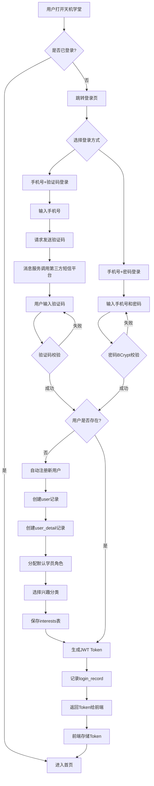
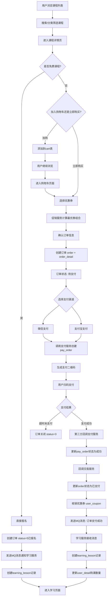
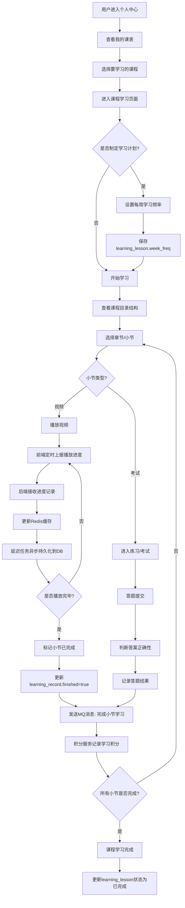
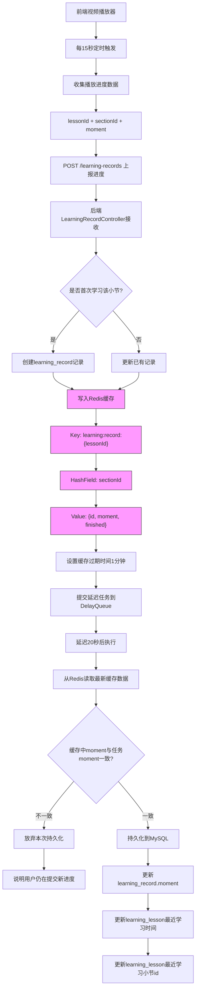
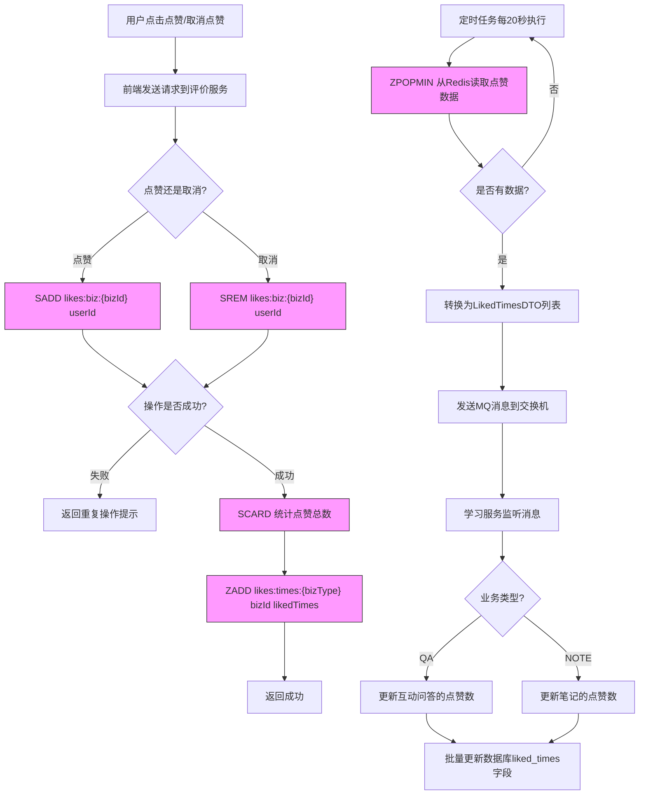
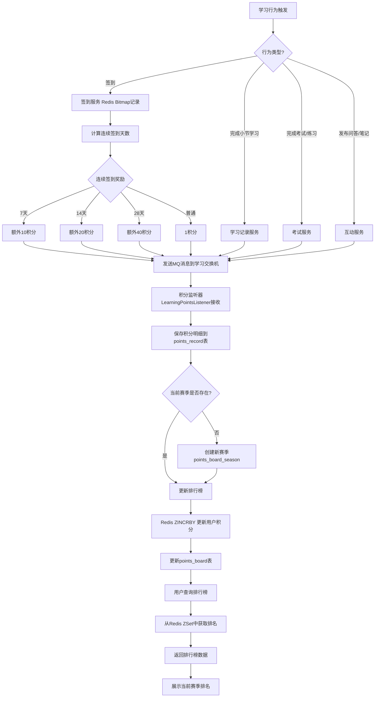
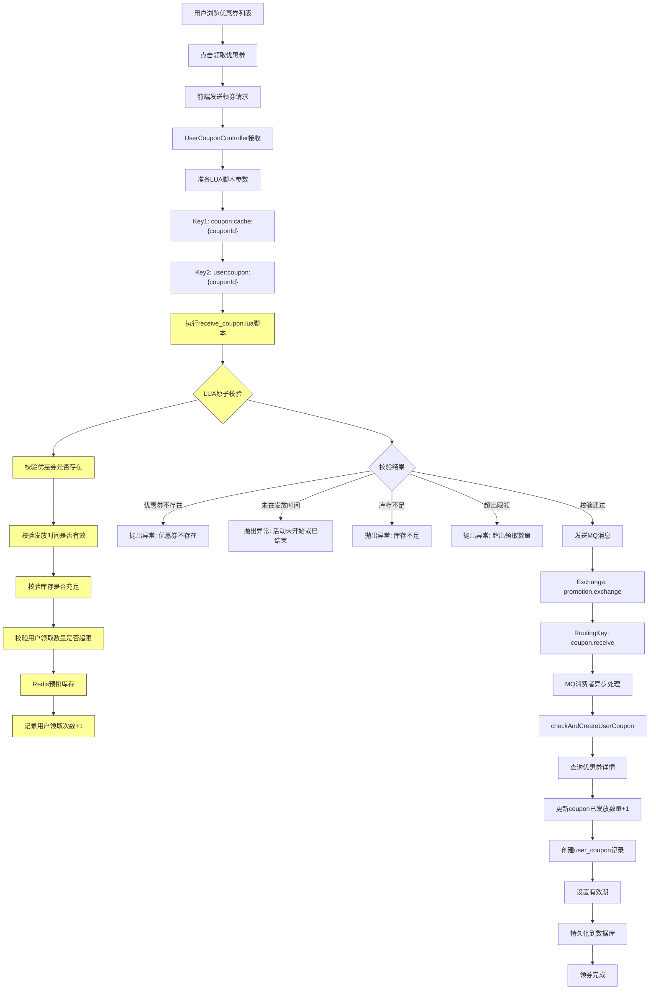
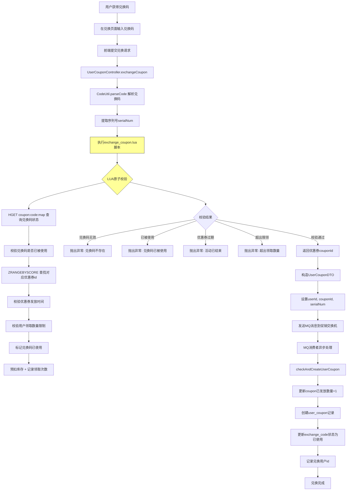
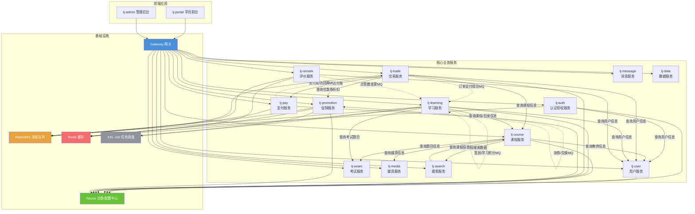

# 天机学堂 - 业务流程图

## 1. 用户注册登录流程

---

## 2. 课程购买流程

---

## 3. 课程学习流程

---

## 4. 视频播放进度记录流程

---

## 5. 点赞业务流程

---

## 6. 积分与排行榜流程

---

## 7. 优惠券领取流程

---

## 8. 优惠券兑换码兑换流程

---

## 9. 微服务间调用关系图

### 微服务间Feign调用关系详细说明

| 调用方 | 被调用方 | 接口 | 说明 |
|--------|----------|------|------|
| tj-auth | tj-user | UserClient | 登录时查询用户信息、校验密码 |
| tj-course | tj-user | UserClient | 查询教师详情、用户信息 |
| tj-course | tj-media | - | 查询媒资/视频信息 |
| tj-course | tj-exam | ExamClient | 查询题目信息 |
| tj-course | tj-search | SearchClient | 同步课程搜索索引 |
| tj-trade | tj-course | CourseClient | 查询课程价格、信息 |
| tj-trade | tj-pay | - | 创建支付单、查询支付状态 |
| tj-trade | tj-promotion | PromotionClient | 计算优惠券折扣 |
| tj-trade | tj-user | UserClient | 查询用户信息 |
| tj-learning | tj-course | CourseClient, CatalogueClient | 查询课程/目录信息 |
| tj-learning | tj-user | UserClient | 查询用户信息 |
| tj-learning | tj-exam | ExamClient | 查询考试题目 |
| tj-search | tj-course | CourseClient, CategoryClient | 同步课程搜索数据 |
| tj-remark | tj-user | UserClient | 查询点赞用户信息 |

### MQ异步消息流转

| 生产者 | 交换机 | RoutingKey | 消费者 | 说明 |
|--------|--------|------------|--------|------|
| tj-pay | - | pay.notify | tj-trade | 第三方支付回调通知 |
| tj-trade | trade.exchange | order.pay.success | tj-learning | 订单支付成功，创建课表 |
| tj-remark | like.record.exchange | liked.times.changed.{bizType} | tj-learning | 点赞数变更通知 |
| tj-learning | learning.exchange | sign.in | tj-learning | 签到积分记录 |
| tj-promotion | promotion.exchange | coupon.receive | tj-promotion | 异步持久化领券记录 |
